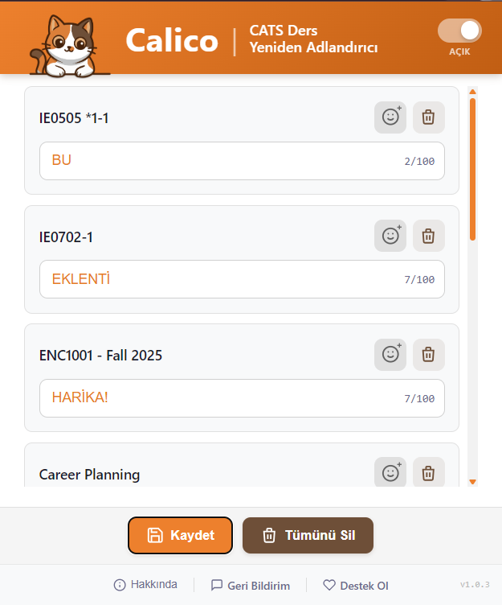

# Calico-CATS-Course-Renamer
A Browser extension that improves UX for Istanbul Kultur University's student portal.
# Calico | CATS Ders Yeniden Adlandırıcı
İstanbul Kültür Üniversitesi öğrenci portalı CATS'in arayüzünü geliştiren bir tarayıcı eklentisi.

[](https://developer.chrome.com/docs/extensions/)
[](https://addons.mozilla.org/)
[](https://developer.chrome.com/docs/extensions/mv3/intro/)
[](LICENSE)
[](CHANGELOG.md)

**İstanbul Kültür Üniversitesi CATS (Course Activity Tracking System) portalında ders isimlerini kişiselleştirmenizi sağlayan tarayıcı uzantısı. Chrome, Edge, Opera, Yandex, Brave, Firefox (Desktop & Android) destekler.**

> ⚠️ **Yasal Uyarı:** Bu uzantı, İstanbul Kültür Üniversitesi veya CATS sistemi ile resmi bir bağlantıya sahip değildir. Bağımsız bir öğrenci projesidir.

---

## 📑 İçindekiler

- [Özellikler](#-özellikler)
- [Ekran Görüntüleri](#-ekran-görüntüleri)
- [Kurulum](#-kurulum)
- [Kullanım](#-kullanım)
- [Teknik Detaylar](#-teknik-detaylar)
- [Dosya Yapısı](#-dosya-yapısı)
- [Geliştirici Notları](#-geliştirici-notları)
- [Sorun Giderme](#-sorun-giderme)
- [Katkıda Bulunma](#-katkıda-bulunma)
- [Gizlilik](#-gizlilik)
- [Lisans](#-lisans)

---

## ✨ Özellikler

### 🎯 Temel Özellikler

| Özellik | Açıklama |
|---------|----------|
| **Ders Yeniden Adlandırma** | Uzun ve karmaşık ders kodlarını anlamlı isimlerle değiştirin |
| **Emoji Desteği** | 120+ emoji ile derslerinizi görsel olarak kategorize edin |
| **Anında Uygulama** | Değişiklikler kaydettiğiniz anda CATS sayfasına yansır |
| **Orijinale Dönüş** | Tek tıkla özel isimleri temizleyin, orijinal isme dönün |
| **Açma/Kapama Toggle** | Uzantıyı geçici olarak devre dışı bırakın |

### 🔧 Teknik Özellikler

- ✅ **Tarayıcı Sync:** Ayarlarınız tarayıcı hesabınızla senkronize edilir
- ✅ **Cross-Browser:** Chrome, Edge, Firefox (Desktop & Android) desteği
- ✅ **Otomatik Algılama:** Yeni dersler otomatik olarak tespit edilir
- ✅ **Performans Optimizasyonu:** Tab gizliyken işlem yapmaz
- ✅ **Hata Toleransı:** Sayfa yapısı değişse bile çalışmaya devam eder
- ✅ **Güvenli:** Sadece CATS portalında çalışır, veri dışarı göndermez

---

## 📸 Ekran Görüntüleri

### Uzantı Arayüzü
```


```

---

## 🚀 Kurulum

### Chrome / Edge / Brave (Manuel)

1. **Dosyaları İndirin**
   ```bash
   git clone https://github.com/cagriyaman/Calico-CATS-Course-Renamer
   cd calico
   ```

2. **Uzantılar Sayfasını Açın**
   - Chrome: `chrome://extensions`
   - Edge: `edge://extensions`
   - Brave: `brave://extensions`

3. **Geliştirici Modunu Aktifleştirin**
   - Sağ üst köşedeki "Geliştirici modu" anahtarını açın

4. **Uzantıyı Yükleyin**
   - "Paketlenmemiş öğe yükle" butonuna tıklayın
   - İndirdiğiniz `calico` klasörünü seçin

5. **Hazır!**
   - Uzantı simgesi tarayıcı araç çubuğunda görünecektir

### Firefox Desktop (Manuel)

1. **Dosyaları İndirin**
   ```bash
   git clone https://github.com/cagriyaman/Calico-CATS-Course-Renamer
   cd calico
   ```

2. **Debugging Sayfasını Açın**
   - Adres çubuğuna `about:debugging#/runtime/this-firefox` yazın

3. **Uzantıyı Yükleyin**
   - "Geçici Eklenti Yükle..." butonuna tıklayın
   - `manifest.json` dosyasını seçin

4. **Hazır!**
   - Uzantı simgesi araç çubuğunda görünecektir

> ⚠️ **Not:** Geçici yüklenen uzantılar Firefox kapandığında silinir. Kalıcı kurulum için AMO'dan yükleyin.

### Firefox Android

1. **Firefox 128+ Gerekli**
   - Google Play'den Firefox'u güncelleyin

2. **AMO Üzerinden Yükleme (Önerilen)**
   - Firefox Add-ons sitesinden yükleyin (yakında)

3. **Koleksiyon Yöntemi (Gelişmiş)**
   - `about:config` → `xpinstall.signatures.required` → `false`
   - Özel koleksiyon oluşturup uzantıyı ekleyin

### Mağaza Linkleri (Yakında)

| Platform | Durum | Link |
|----------|-------|------|
| Chrome Web Store | 🚧 Hazırlanıyor | - |
| Firefox Add-ons (AMO) | 🚧 Hazırlanıyor | - |
| Edge Add-ons | 🚧 Planlanıyor | - |

---

## 📖 Kullanım

### İlk Kullanım

1. **CATS Portalına Giriş Yapın**
   - [cats.iku.edu.tr](https://cats.iku.edu.tr) adresine gidin
   - Öğrenci bilgilerinizle giriş yapın

2. **Uzantıyı Açın**
   - Tarayıcı araç çubuğundaki Calico simgesine tıklayın
   - Dersleriniz otomatik olarak listelenecektir

3. **Ders İsimlerini Değiştirin**
   - Değiştirmek istediğiniz dersin altındaki kutuya yeni isim yazın
   - Emoji eklemek için 😊 butonuna tıklayın

4. **Kaydedin**
   - "Kaydet" butonuna tıklayın
   - Değişiklikler anında CATS sayfasına uygulanır

### Özellik Detayları

#### 🏷️ Ders İsmi Değiştirme
```
Orijinal:  "BLG101 - Introduction to Programming - Fall 2024"
Özel:      "💻 Programlama"
```

#### 😊 Emoji Ekleme
- Her ders için emoji butonuna tıklayın
- 7 kategoride 120+ emoji seçeneği
- Kategoriler: Nesneler, Semboller, Aktiviteler, Doğa, Yerler, Yemek, İfadeler

#### 🔄 Orijinale Dönüş
- Tek bir ders için: Dersin yanındaki ✕ butonuna tıklayın
- Tüm dersler için: "Tümünü Sil" butonuna tıklayın

#### 🔘 Uzantıyı Açma/Kapama
- Header'daki toggle ile uzantıyı geçici olarak devre dışı bırakın
- Kapalıyken orijinal ders isimleri gösterilir
- Ayarlarınız korunur, tekrar açtığınızda geri gelir

---

## ⚙️ Teknik Detaylar

### Desteklenen Tarayıcılar

| Tarayıcı | Versiyon | Durum |
|----------|----------|-------|
| Google Chrome | 88+ | ✅ Tam Destek |
| Microsoft Edge | 88+ | ✅ Tam Destek |
| Brave | 1.20+ | ✅ Tam Destek |
| Opera | 74+ | ⚠️ Test Edilmedi |
| Firefox Desktop | 128+ | ✅ Tam Destek |
| Firefox Android | 128+ | ✅ Tam Destek |

### Mimari

```
┌─────────────────────────────────────────────────────────────┐
│                    Browser Extension                         │
│              (Chrome / Firefox / Edge)                       │
├─────────────────────────────────────────────────────────────┤
│                                                              │
│  ┌──────────────┐    ┌──────────────┐    ┌──────────────┐   │
│  │  Options UI  │    │   Storage    │    │Content Script│   │
│  │  (Popup)     │◄──►│   (Sync)     │◄──►│  (CATS DOM)  │   │
│  └──────────────┘    └──────────────┘    └──────────────┘   │
│         │                   │                    │           │
│         ▼                   ▼                    ▼           │
│  ┌──────────────┐    ┌──────────────┐    ┌──────────────┐   │
│  │  options.js  │    │  storage.js  │    │  content.js  │   │
│  │  options.css │    │  config.js   │    │              │   │
│  │  options.html│    │              │    │              │   │
│  │  emojis.js   │    │              │    │              │   │
│  └──────────────┘    └──────────────┘    └──────────────┘   │
│                                                              │
└─────────────────────────────────────────────────────────────┘
```

### Storage Şeması

```javascript
// storage.sync (Chrome & Firefox senkronize storage)
{
  // Ders isim eşleştirmeleri
  "courseMap": {
    "BLG101 - Introduction to Programming": "💻 Programlama",
    "MAT101 - Calculus I": "📐 Matematik"
  },
  
  // Tespit edilen dersler
  "detectedCourses": [
    "BLG101 - Introduction to Programming",
    "MAT101 - Calculus I"
  ],
  
  // Uzantı açık/kapalı durumu
  "extensionEnabled": true,
  
  // Storage versiyon (migration için)
  "storageVersion": 1
}
```

> **Not:** Veriler, Chrome'da Google hesabınızla, Firefox'ta Firefox Sync ile senkronize edilir.

### Selector Stratejisi

Uzantı, CATS portalındaki ders isimlerini bulmak için kademeli selector stratejisi kullanır:

```javascript
// Primary Selectors (Öncelikli)
"#topnav .Mrphs-sitesNav__menuitem a.link-container span"

// Fallback Selectors (Yedek)
".Mrphs-sitesNav__menuitem a span"
```

Bu yaklaşım sayesinde CATS arayüzü güncellendiğinde bile uzantı çalışmaya devam eder.

---

## 📁 Dosya Yapısı

```
calico/
│
├── 📄 manifest.json          # Chrome + Firefox birleşik manifest (V3)
├── 📄 browser-polyfill.js    # Chrome/Firefox API uyumluluk katmanı
├── 📄 config.js              # Merkezi konfigürasyon
├── 📄 storage.js             # Storage API wrapper (cross-browser)
├── 📄 content.js             # CATS sayfasında çalışan script
├── 📄 options.html           # Popup HTML yapısı
├── 📄 options.css            # Popup stilleri
├── 📄 options.js             # Popup JavaScript mantığı
├── 📄 emojis.js              # Emoji veritabanı
├── 🖼️ logo.png               # Popup header logosu
│
├── 📁images/                 # Extension ekran alıntıları
│   ├── calico_screenshot_1.png
│
├── 📁 icons/                 # Uzantı ikonları
│   ├── icon16.png
│   ├── icon32.png
│   ├── icon48.png
│   ├── icon96.png            # Firefox için
│   └── icon128.png
│
├── 📄 README.md              # Bu dosya
├── 📄 CHANGELOG.md           # Sürüm geçmişi
├── 📄 ROADMAP.md             # Gelecek planları
├── 📄 PRIVACY.md             # Gizlilik politikası
└── 📄 LICENSE                # MIT Lisansı
```

### Dosya Açıklamaları

| Dosya | Boyut | Açıklama |
|-------|-------|----------|
| `manifest.json` | ~1.3KB | Extension metadata, izinler (Chrome + Firefox) |
| `browser-polyfill.js` | ~8KB | Chrome/Firefox API uyumluluk katmanı |
| `config.js` | ~3KB | Selector'lar, timeout'lar, storage key'leri |
| `storage.js` | ~20KB | Storage CRUD, migration, error handling |
| `content.js` | ~11KB | DOM manipulation, MutationObserver |
| `options.js` | ~21KB | UI logic, event handling |
| `options.css` | ~16KB | Calico teması, responsive tasarım |
| `options.html` | ~8KB | Popup HTML yapısı |
| `emojis.js` | ~11KB | 120+ kategorize emoji (7 kategori) |

---

## 🔧 Geliştirici Notları

### Gereksinimler

- Node.js 16+ (sadece linting için, opsiyonel)
- Chrome 88+ veya Firefox 128+
- Git

### Yerel Geliştirme

```bash
# Repository'yi klonlayın
git clone https://github.com/cagriyaman/Calico-CATS-Course-Renamer
cd calico

# Chrome'a yükleyin
# chrome://extensions → Geliştirici modu → Paketlenmemiş öğe yükle

# Firefox'a yükleyin
# about:debugging → Geçici Eklenti Yükle → manifest.json seç
```

### Konfigürasyon

Tüm ayarlar `config.js` dosyasında merkezi olarak yönetilir:

```javascript
const CONFIG = {
  // Storage key'leri
  STORAGE_KEYS: {
    COURSE_MAP: "courseMap",
    DETECTED_COURSES: "detectedCourses",
    EXTENSION_ENABLED: "extensionEnabled"
  },
  
  // DOM Selector'ları
  SELECTORS: {
    COURSE_NAMES: [...],
    COURSE_NAMES_FALLBACK: [...],
    OBSERVER_TARGET: "#topnav"
  },
  
  // Zamanlama
  TIMEOUTS: {
    DETECT_THROTTLE: 2000,
    MUTATION_THROTTLE: 1000
  },
  
  // Input limitleri
  INPUT: {
    MAX_COURSE_NAME_LENGTH: 100,
    FORBIDDEN_CHARS: ['<', '>', '"', "'", '`', '\\']
  }
};
```

### Error Handling

Uzantı, kapsamlı hata yönetimi içerir:

```javascript
// Error türleri
const ERROR_TYPES = {
  STORAGE_READ: "Storage okuma hatası",
  STORAGE_WRITE: "Storage yazma hatası",
  QUOTA_EXCEEDED: "Depolama alanı dolu",
  CONTEXT_INVALID: "Extension context geçersiz",
  UNKNOWN: "Bilinmeyen hata"
};
```

### Migration Sistemi

Storage şeması değişikliklerinde veri kaybını önlemek için migration sistemi mevcuttur:

```javascript
// Mevcut: v1
// Gelecek migration örneği:
migrations = {
  1: function(done) {
    // v1 -> v2 migration
    done(true);
  }
};
```

---

## 🐛 Sorun Giderme

### Sık Karşılaşılan Sorunlar

#### ❓ "Henüz ders bulunamadı" mesajı görüyorum

**Çözüm:**
1. CATS portalına giriş yaptığınızdan emin olun
2. Ana sayfada olduğunuzdan emin olun (üst menüde dersler görünmeli)
3. Sayfayı yenileyin (F5)
4. Uzantıyı kapatıp açın

#### ❓ Değişiklikler CATS'e yansımıyor

**Çözüm:**
1. "Kaydet" butonuna tıkladığınızdan emin olun
2. CATS sayfasını yenileyin
3. Uzantının toggle'ının açık olduğunu kontrol edin
4. Chrome'u yeniden başlatın

#### ❓ Uzantı simgesi görünmüyor

**Çözüm:**
1. Chrome araç çubuğunda puzzle simgesine tıklayın
2. Calico'nun yanındaki pin simgesine tıklayın

#### ❓ "Context invalid" hatası alıyorum

**Açıklama:** Bu, uzantı güncellendiğinde veya yeniden yüklendiğinde oluşur.

**Çözüm:** CATS sayfasını yenileyin (F5)

### Hata Bildirimi

Bir hata bulduysanız:

1. Chrome Console'u açın (F12 → Console)
2. `[Calico]` ile başlayan hataları not edin
3. GitHub Issues'da yeni bir issue açın
4. Hata mesajını ve adımları ekleyin

---

## 🤝 Katkıda Bulunma

Katkılarınızı memnuniyetle karşılıyoruz!

### Katkı Süreci

1. **Fork** yapın
2. Feature branch oluşturun (`git checkout -b feature/yeni-ozellik`)
3. Değişikliklerinizi commit edin (`git commit -m 'feat: Yeni özellik eklendi'`)
4. Branch'i push edin (`git push origin feature/yeni-ozellik`)
5. **Pull Request** açın

### Commit Mesajları

[Conventional Commits](https://www.conventionalcommits.org/) standardını kullanıyoruz:

```
feat: Yeni özellik eklendi
fix: Hata düzeltildi
docs: Dokümantasyon güncellendi
style: Kod formatı düzeltildi
refactor: Kod refactor edildi
perf: Performans iyileştirmesi
test: Test eklendi
```

### Kod Standartları

- ES5 uyumlu JavaScript (var kullanımı)
- JSDoc yorumları
- Türkçe yorum ve mesajlar
- 2 space indentation

---

## 🔒 Gizlilik

Bu uzantı kullanıcı gizliliğine büyük önem verir. Detaylı bilgi için [PRIVACY.md](PRIVACY.md) dosyasına bakınız.

### Özet

| Konu | Durum |
|------|-------|
| Kişisel veri toplama | ❌ Yok |
| Harici sunucu iletişimi | ❌ Yok |
| Üçüncü taraf paylaşımı | ❌ Yok |
| Reklam / İzleme | ❌ Yok |
| Yerel depolama | ✅ Sadece tarayıcı storage |
| Açık kaynak | ✅ MIT Lisansı |

**Verileriniz nerede saklanır?**
- Tüm veriler tarayıcınızın yerel Storage API'sinde saklanır
- Chrome'da Google hesabınızla, Firefox'ta Firefox Sync ile senkronize edilebilir
- Hiçbir veri harici sunuculara gönderilmez

---

## 📄 Lisans

Bu proje [MIT Lisansı](LICENSE) ile lisanslanmıştır.

### Türkçe Özet (Bilgilendirme Amaçlıdır)

> ⚠️ **Not:** Bu özet yasal bağlayıcılık taşımaz. Geçerli lisans metni için [LICENSE](LICENSE) dosyasına bakınız.

| İzin | Durum |
|------|-------|
| ✅ Ticari kullanım | İzin verilir |
| ✅ Değiştirme | İzin verilir |
| ✅ Dağıtma | İzin verilir |
| ✅ Özel kullanım | İzin verilir |
| ✅ Alt lisanslama | İzin verilir |

| Koşul | Açıklama |
|-------|----------|
| 📋 Lisans bildirimi | Telif hakkı ve lisans metni korunmalıdır |

| Sorumluluk | Durum |
|------------|-------|
| ❌ Garanti | Yazılım "olduğu gibi" sunulur |
| ❌ Sorumluluk | Yazarlar zararlardan sorumlu tutulamaz |

### Kod ve Bileşenler

Bu projede kullanılan tüm JavaScript kodu (`browser-polyfill.js`, `storage.js`, `content.js`, `options.js`, vb.) proje için özel olarak geliştirilmiştir. Harici üçüncü taraf kütüphane veya framework kullanılmamıştır.

**Not:** `browser-polyfill.js` dosyası, Mozilla'nın `webextension-polyfill` kütüphanesi **değildir**. Chrome ve Firefox API farklarını gidermek için bu proje kapsamında sıfırdan yazılmış özgün bir uyumluluk katmanıdır.

Emoji verileri [Unicode Standard](https://unicode.org/) referans alınarak derlenmiştir.

---

## 📬 İletişim

- **Geri Bildirim Formu:** [https://forms.gle/yZdC3aWGvnP3CgHEA]
- **GitHub Issues:** [https://github.com/cagriyaman/Calico-CATS-Course-Renamer/issues]
- **E-posta:** [calico.extension@gmail.com]

---

## 🙏 Teşekkürler

- İstanbul Kültür Üniversitesi öğrencilerine
- Geri bildirim sağlayan tüm kullanıcılara
- Açık kaynak topluluğuna

---

<p align="center">
  <b>🐱 Calico ile derslerinizi kişiselleştirin!</b>
  <br><br>
  <a href="https://github.com/cagriyaman/Calico-CATS-Course-Renamer">⭐ Yıldız verin</a> · 
  <a href="https://github.com/cagriyaman/Calico-CATS-Course-Renamer/issues">🐛 Hata bildirin</a> · 
  <a href="https://github.com/cagriyaman/Calico-CATS-Course-Renamer/pulls">🔧 Katkıda bulunun</a>
</p>
